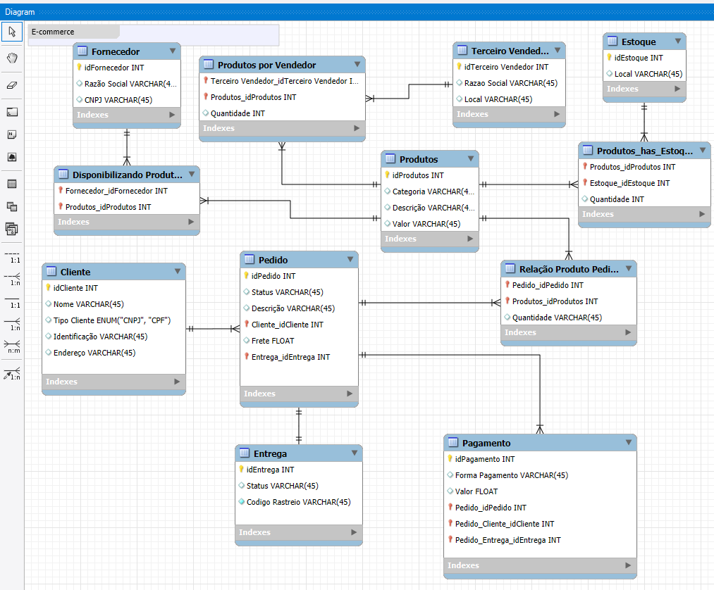

# Projeto Conceitual de Banco de Dados – E-commerce

Este projeto foi desenvolvido como parte do desafio da **Digital Innovation One (DIO)** no bootcamp, com o objetivo de refinar um modelo conceitual de banco de dados voltado para um sistema de e-commerce.

---

## 📌 Contexto

O modelo representa um sistema de e-commerce que gerencia **clientes, pedidos, produtos, fornecedores, estoque, vendedores terceiros, pagamentos e entregas**.

O ponto de partida foi um modelo básico desenvolvido em aula. Em seguida, ele foi refinado para atender aos seguintes requisitos do desafio:

1. **Cliente PJ e PF**  
   - Um cliente pode ser **Pessoa Física (PF)** ou **Pessoa Jurídica (PJ)**, mas nunca ambos ao mesmo tempo.  
   - Para isso, o atributo `tipoCliente` foi adicionado, aceitando os valores `CPF` ou `CNPJ`.  
   - O campo `Identificação` armazena o número correspondente, de acordo com o tipo.

2. **Pagamento**  
   - Criada a entidade `Pagamento`, permitindo que **um pedido tenha mais de uma forma de pagamento**.  
   - Campos principais: `FormaPagamento` e `Valor`.  
   - Relacionamento: um pedido pode estar vinculado a múltiplos pagamentos.

3. **Entrega**  
   - Criada a entidade `Entrega`, vinculada a cada pedido.  
   - Campos principais: `Status` (pendente, enviado, entregue, etc.) e `CodigoRastreio` para rastreamento do pedido.

---

## 📊 Modelo Conceitual

Abaixo está a representação do diagrama refinado:

---

## 🚀 Como Utilizar

1. O diagrama foi construído no **MySQL Workbench**.  
2. O arquivo `.mwb` presente em '/workbench_diagram/diagram_ecommerce.mwb' pode ser aberto no Workbench para futuras alterações.  
3. Caso necessário, o modelo pode ser traduzido para **modelo lógico/físico (DDL SQL)**.  

---

## 📚 Entidades Principais

- **Cliente** → Pessoa Física (CPF) ou Jurídica (CNPJ).  
- **Pedido** → Registra informações de status, descrição e frete.  
- **Produto** → Contém dados de categoria, descrição e valor.  
- **Pagamento** → Suporta múltiplas formas de pagamento por pedido.  
- **Entrega** → Controla status e código de rastreio.  
- **Fornecedor / Estoque / Vendedor Terceiro** → Complementam a gestão dos produtos.

---

Desenvolvido como parte do bootcamp da [Digital Innovation One](https://www.dio.me/).
